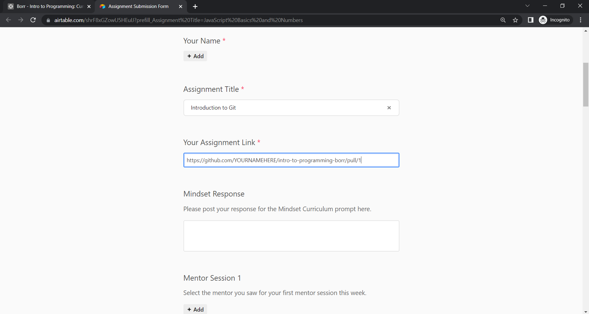
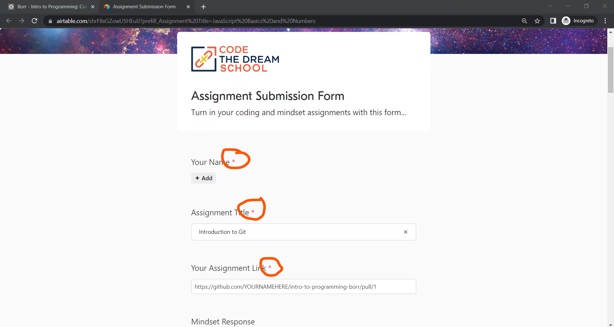

[< Back to Overview](../../README.md)

# How to: Submit an Assignment

## Step 1: In your class curriculum dashboard, click the link to "Submit Assignment".  You can also get to the submission form using this link: [http://tiny.cc/ctd-borr-assignment](https://airtable.com/shrSiBzWPqo1xUBv4)

     **Preview screenshot coming soon**

## Step 2: Complete the form; be sure to paste the URL you copied in the previous tutorial
**NOTE:** In this screenshot, where the URL has "YOURNAMEHERE" should be _your_ GitHub username. 

## Step 3: Be sure you complete all required fields (required fields have a red asterisk after the label)
**NOTE:** The Questions field will be shared with your reviewer, so they may address your questions when reviewing your work.  However, if you wish to have a **faster** answer to your questions, be sure you are asking them during your mentor session(s) or are posting them in the #borr-discussion channel in Slack.

## Step 4: Click "Submit" and you're done!

---

Created by [Code the Dream](https://www.codethedream.org)
