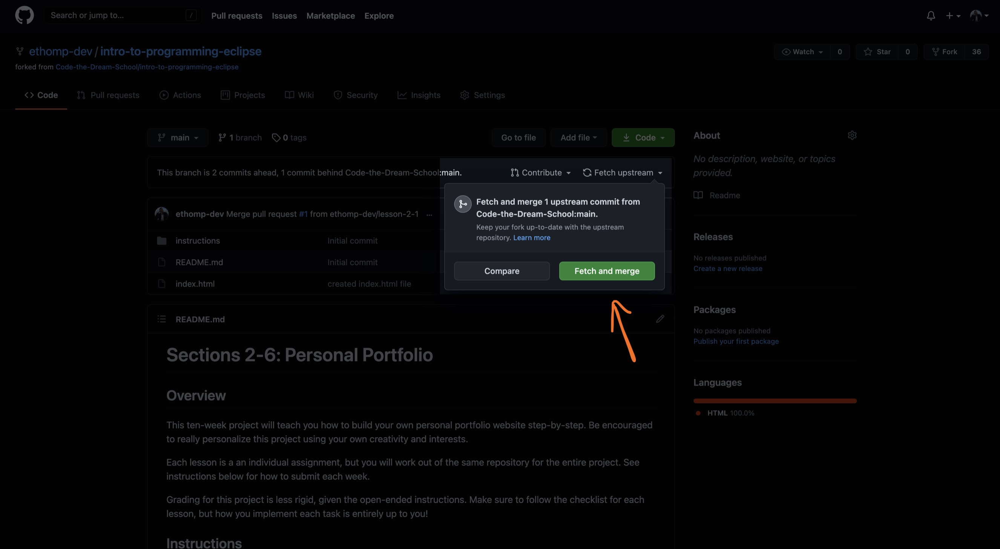

[< Back to Overview](../../README.md)

# Lesson 4.5: CSS Layout

This assignment will teach you the following:

- CSS Box Model
- CSS Display Property
- CSS Positioning
- CSS Media Queries
- Flexbox
- (Optional) CSS Grid

---

## Instructions

### Getting Started:

Merge your pull request from the previous lesson (if you haven't already):

[View tutorial](../common/how-to-merge.md)

Fetch the updated instructions from the base repository:

> Note: you may receive a conflict if you've made changes to the README or other instructions

Checkout your main branch and pull changes:

    git checkout main
    git pull

Create a new local branch to work on separate from the `main` branch:

    git checkout -b lesson-4-5

Now, open the project directory in your code editor and continue to the next section.

### Task List:

For this assignment, you will be transforming your webpage with a more robust grid layout.

- [ ] Add a navigational header to your webpage
  - [ ] The navigation menu should include a link to each of your sections (i.e. "About", "Experience", etc.)
  - [ ] (Optional) Make the header sticky/fixed on the page
- [ ] Change the layout of your "Experience" section using rows and columns so items are displayed in a grid rather than a list
  - [ ] Hint: use either Flexbox or CSS Grid
- [ ] Update the "Leave a Message" form to use Flexbox or CSS Grid
- [ ] Use Media Queries to make sure the webpage is responsive for all device sizes (mobile, tablet, desktop, etc.)

This is the basic rubric, but we encourage you to think beyond this list and come up with your own ideas to make your webpage unique!

### Final Step:

Check the status of your local repository to double-check the changes you made:

    git status

Stage the file(s) that you edited:

    git add .

Check the status again and notice that the changes from before are now staged:

    git status

Create a commit for the changes you made and add a message describing the changes you made:

> Note: Replace `<message>` with your message

    git commit -m "<message>"

Push your commit to the remote repository (visible in GitHub):

    git push

Check the log to make sure your commit has been published:

    git log --oneline

Create a pull request and submit:

[View instructions](../common/how-to-pull-request.md)

---

Created by [Code the Dream](https://www.codethedream.org)
